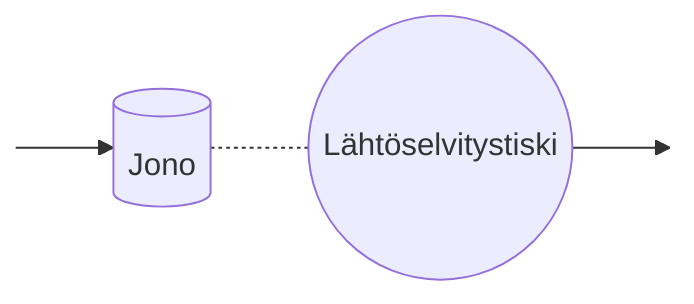
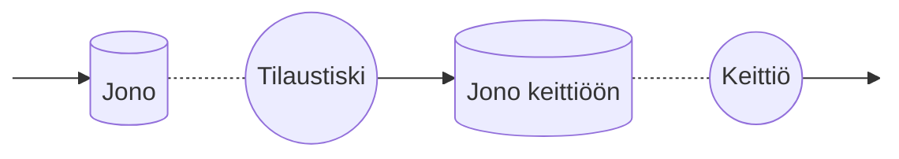

# Suuntautumistehtävät 4 – Suorituskykymuuttujat

## Tehtävä 1 (W) – Esimerkki: Terveyskeskus

Terveyskeskuksessa suorituskykymittarit voidaan määritellä seuraavasti:

- **A (Saapumiset)**: Potilaiden määrä, jotka tulevat terveyskeskukseen.
- **C (Valmistuneet)**: Potilaiden määrä, jotka on hoidettu ja lähteneet.
- **B (Varattu aika)**: Aika, jonka lääkärit käyttävät aktiivisesti potilaiden hoitamiseen.
- **T (Kokonaisaika)**: Aika, jonka aikana terveyskeskuksen toimintaa tarkkaillaan (esim. 8 tuntia).
- **U (Hyödyntämisaste)**: Kuinka kiireisiä lääkärit ovat: jos U = 0,75, lääkärit työskentelivät 75 % ajasta.
- **X (Läpimeno)**: Potilaiden hoitonopeus, esim. 30 potilasta / 8 tuntia.
- **S (Palveluaika)**: Keskimääräinen aika, jonka lääkäri käyttää potilaan hoitamiseen.
- **Rᵢ (Vasteaika)**: Yksittäisen potilaan odotusaika + hoitoaika.
- **W (Odotusaika)**: Kaikkien potilaiden Rᵢ-arvojen summa.
- **R (Keskimääräinen vasteaika)**: Keskimääräinen aika, jonka potilas viettää järjestelmässä (saapumisesta poistumiseen).
- **N (Keskimääräinen jonon pituus)**: Keskimääräinen potilaiden määrä järjestelmässä (jonossa + hoidossa).

---

## Tehtävä 2 (W) – Suorituskykymuuttujien kategoriat

Suorituskykymittareita voidaan päivittää ja ylläpitää seuraavien kategorioiden mukaan:

- **Järjestelmätason mittarit**: esim. simulaation kokonaisaika (T), saapuneiden määrä (A), valmistuneet (C).
- **Palvelupisteen mittarit**: esim. varattu aika (B), hyödyntämisaste (U), palveluaika (S), jonon pituus (N).
- **Asiakaskohtaiset mittarit**: esim. vasteaika Rᵢ, odotusaika W.
- **Johdetut mittarit**: Lasketaan yllä olevista, esim. X, U, R, N.

Päivitykset tapahtuvat yleensä:

- **Saapuessa**: A kasvaa, saapumisaika tallennetaan.
- **Palvelun alussa**: varatun ajan seuranta alkaa, odotusaika lasketaan.
- **Palvelun lopussa**: C kasvaa, varattu aika päivitetään, Rᵢ viimeistellään.

---

## Tehtävä 3 (W) – Reaaliaikaiset järjestelmät ja kaaviot

### a) Lentokentän lähtöselvitys



### b) Pikaruokaravintola



---

## Tehtävä 4 (W) – Yleinen simulaatiosilmukka

```pseudocode
Alusta simulaatiokello
Alusta tapahtumalista ja järjestelmän tila

while simulaatio ei ole ohi:
    Vaihe A: Etene seuraavan tapahtuman aikaan
    Vaihe B: Suorita seuraava tapahtuma (esim. saapuminen, poistuminen)
        - Päivitä järjestelmän tila
        - Aikatauluta tarvittaessa uusia tapahtumia
    Vaihe C: Päivitä tilastomuuttujat (esim. B, W, R)
        - Perustuen järjestelmän muutoksiin ja kuluneeseen aikaan
```

---

## Tehtävä 5 (W) – A-, B- ja C-vaiheiden selitykset

- **A-vaihe (Ajan eteneminen)**:
    - Siirtää simulaatiokellon seuraavan tapahtuman aikaan.
    - Etsii tapahtumalistasta pienimmän aikaleiman tapahtuman.

- **B-vaihe (Tapahtuman suoritus)**:
    - Suorittaa tapahtuman logiikan (saapuminen, palvelun aloitus, palvelun päättyminen).
    - Päivittää järjestelmän tilan (esim. siirtää asiakasta jonosta palveluun).
    - Lisää uusia tapahtumia tapahtumalistaan.

- **C-vaihe (Tilastojen päivitys)**:
    - Päivittää suorituskykymuuttujat kuten varattu aika, odotusaika, jonon pituus.
    - Käyttää viimeisimmän päivityksen ja nykyhetken välistä aikaa laskuihin.

Nämä vaiheet toteutetaan tyypillisesti erillisinä metodeina tai lohkoina tapahtumapohjaisessa simulaatiokehyksessä.